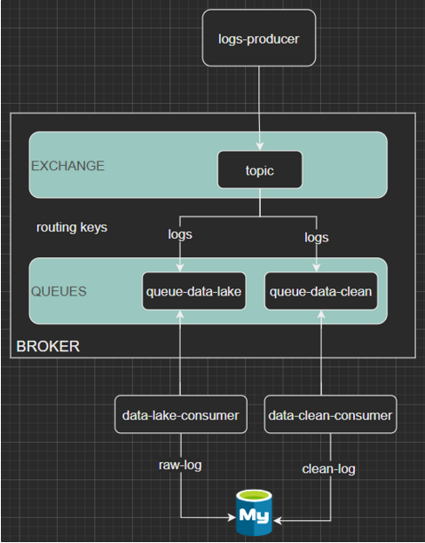
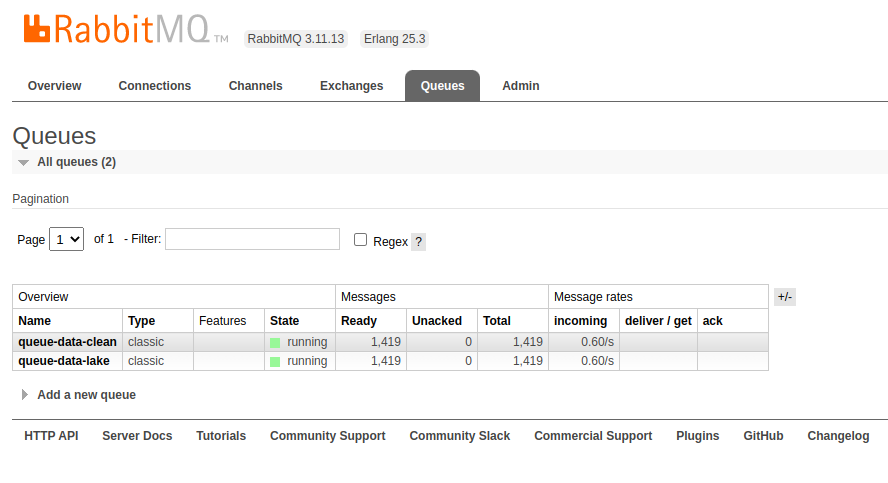
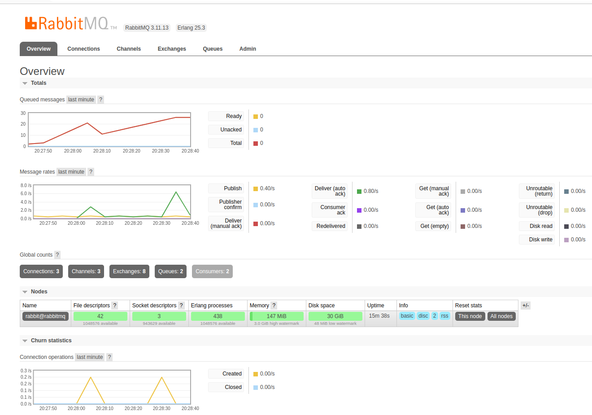
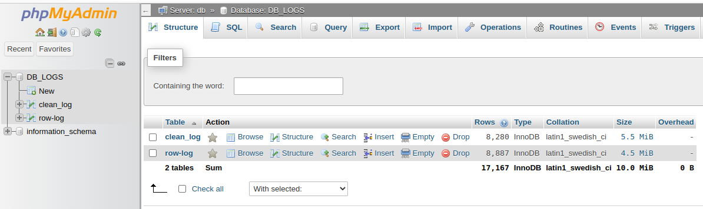

# Python-rabbitmq-mysql-phpmyadmin
Data Streaming

### Contexte : Gestion recolte et traitement de flux de données temps réel avec 
Lorsque des flux massifs de données hétérogènes nous parviennent, comment les exploiter sans être submergés ? C'est tout l'enjeu du traitement de données temps réel. Au quotidien, nos actions génèrent des quantités massives de données dont la valeur réside dans le fait qu'elles soient transmises et décortiquées le plus rapidement possible et cela que repond le traitement de données à temps réel.

### Objectif : Faire du traitement de données à temps réel
Récupérer les logs du server web, les traiter à temps réel et les stocker dans une base de données mysql. Pour cela il faut :

### Architecture 

### logs-producer
- logs-producer : lit ligne par ligne les logs disponibles dans le dossier assets (fichier de logs web-server-nginx.log) et les envoyer dans deux files d'attente : queue-data-lake et queue-data-clean. En suite, les  consumers viendront consommer, avec la methode FIFO (first in first out), en temps réel dans les differentes files d'attentes.

### Queues
- queue-data-lake : qui envoie les données vers le data-lake-consomer
- queue-data-clean : qui envoie les données vers le data-clean-consomer

### Consumers
- data-lake-consumer : prend les logs dans la queue-data-lake et se connecter à une base de données mysql, par le biais de l'ORM sqlalchemy, pour ajouter les meta données dans la table raw-log 
- data-clean-consumer : prend les logs dans la queue-clean-lake et se connecter à une base de données mysql, par le biais de l'ORM sqlalchemy, pour ajouter, après transformation, traitement et nettoyage, logs dans la table clean-log 

### Prérequis

- Orchestration avec docker-compose de :
 - RabbitMQ
 - phpMyAdmin
 - et mysql
- Python

### Installation
- Cloner le projet :
    git clone https://github.com/Medgoby/Python-rabbitmq-mysql-phpmyadmin.git
- Se placer dans le donnsier :
    cd Python-rabbitmq-mysql-phpmyadmin
- Création d'un environnement virtuel et l'activé :
    python3 -m venv env
    source env/bin/activate
- Installer les requirements avec :
    pip install -r requirements.txt

### Configuration de la base de données et de rabbitmq:
- Dans le fichier .env.exemple remplacer les guillemets ("") par les valeurs que vous souhaitez pour la base de données et pour rabbitmq et renommer le fichier en .env

### Lancer le traitement :
- Le contenaire : 
    docker-compose up -d
- Le log producer :
    python3 logs-producer.py
    
- le data-clean-consumer
    python3 data-clean-consumer
- le le data-lake-consumer
    python3 data-lake-consumer

### Visualisation des logs dans PHPMyAdmin dans les 2 tables

